# Лабораторная работа: Реализация методов массива в JavaScript

##  Цель работы
Изучить принципы работы встроенных методов массивов JavaScript и реализовать их собственные аналоги с использованием базовых конструкций языка.

##  Теоретическая часть
Массивы в JavaScript предоставляют встроенные методы для обработки данных:
- `forEach` — перебор элементов массива
- `map` — преобразование массива
- `filter` — фильтрация элементов
- `find` — поиск элемента
- `some` — проверка наличия хотя бы одного подходящего элемента
- `every` — проверка всех элементов
- `reduce` — сведение массива к одному значению

В данной работе требуется реализовать аналоги этих методов вручную без использования встроенных функций массива.

##  Задания

1.1 Реализовать функцию `printArray`, которая выводит элементы массива в формате:

Element i: value x
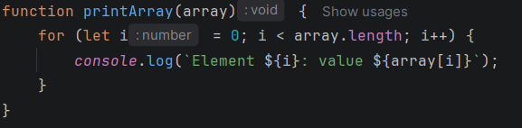

1.1Реализовать функцию `printArray1`, которая выводит элементы массива в формате:

i: x
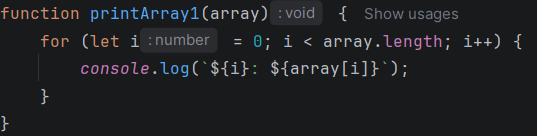
1.2 Реализовать функцию `forEach(array, callback)`, которая выполняет callback для каждого элемента массива и передает:
- элемент
- индекс
- массив
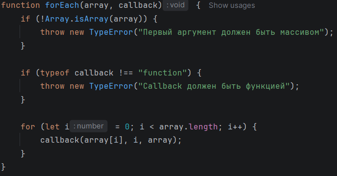
2. Реализовать функцию `map(array, callback)`, которая возвращает новый массив, где каждый элемент является результатом выполнения callback.
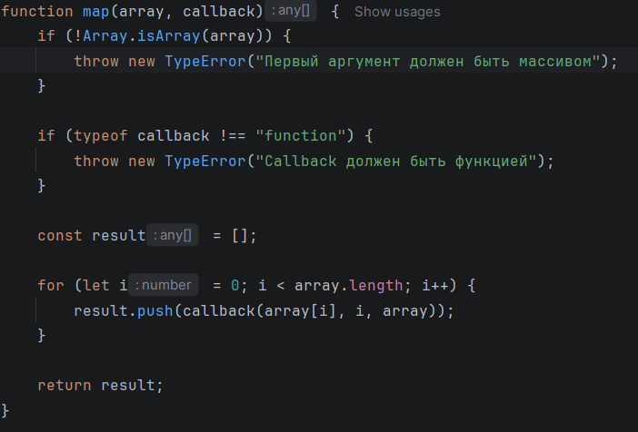
3. Реализовать функцию `filter(array, callback)`, которая возвращает новый массив, содержащий только элементы, удовлетворяющие условию callback.
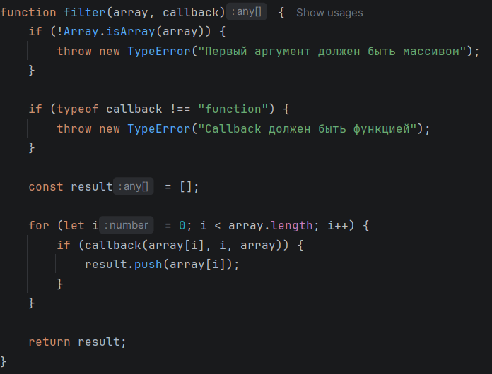
4. Реализовать функцию `find(array, callback)`, которая возвращает первый элемент массива, удовлетворяющий условию callback. Если элемент не найден — возвращает `undefined`.
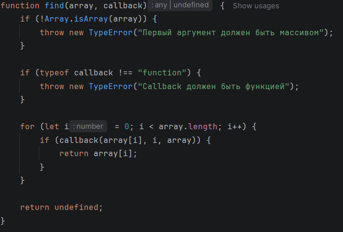
5. Реализовать функцию `some(array, callback)`, которая проверяет, есть ли хотя бы один элемент, удовлетворяющий условию callback. Возвращает `true` или `false`.
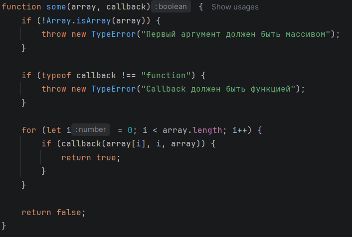
6. Реализовать функцию `every(array, callback)`, которая проверяет, удовлетворяют ли все элементы массива условию callback. Возвращает `true` или `false`.
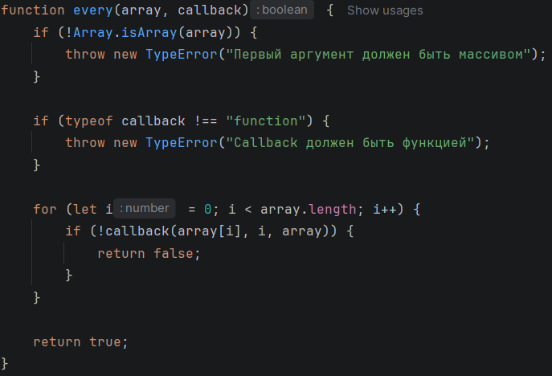
7. Реализовать функцию `reduce(array, callback, initialValue)`, которая сводит массив к одному значению. Если начальное значение не задано, первым аккумулятором становится первый элемент массива.
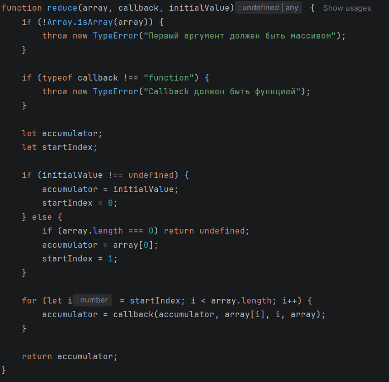

##  Проверка работы
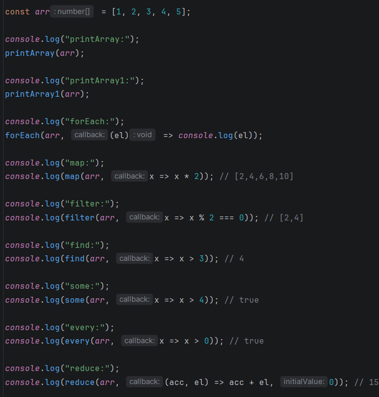

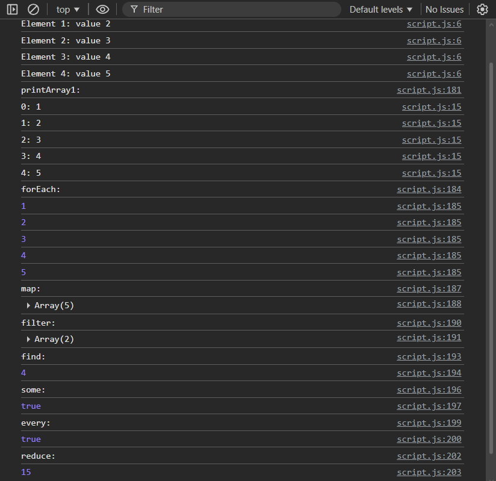

## Контрольные вопросы и ответы

### 1. В чем преимущества использования колбэков при работе с массивами?
Колбэки позволяют гибко задавать логику обработки данных, переиспользовать функции и отделять алгоритм обхода массива от конкретной операции.

### 2. Какие проблемы могут возникать при использовании колбэков и как их избежать?
Возможны ошибки в логике callback, потеря контекста `this`, передача не функции и сложность чтения кода при вложенности.  
Избежать можно с помощью проверок типов, использования стрелочных функций, `bind`, а также применения `Promise` и `async/await`.

### 3. Как реализовать функции map, filter, find, some, every и reduce без использования встроенных методов массивов?
Через цикл `for` с обходом массива и вызовом callback для каждого элемента.  
Результат:
- `map` — формирует новый массив
- `filter` — отбирает элементы по условию
- `find` — возвращает первый подходящий элемент
- `some` — проверяет наличие хотя бы одного подходящего элемента
- `every` — проверяет, что все элементы подходят
- `reduce` — накапливает итоговое значение через аккумулятор

## Вывод
В ходе выполнения лабораторной работы были реализованы основные методы обработки массивов JavaScript вручную. Это позволило изучить принципы работы встроенных функций массива, а также закрепить навыки использования циклов, функций высшего порядка и обработки данных.

Также были получены практические навыки работы с callback-функциями и алгоритмами обработки массивов.