Конечно! Вот полностью переработанная версия твоей лабораторной работы №3 в формате Markdown, без стикеров и без горизонтальных линий, чистая и аккуратная для вставки скриншотов:

# Лабораторная работа №3

## Основы работы с массивами, функциями и объектами в JavaScript

## Цель работы

Изучить основы работы с массивами и функциями в JavaScript, применяя их для обработки и анализа транзакций.

## Условие

Разработать консольное приложение для анализа транзакций с использованием массива объектов и встроенных методов массивов.

## Ход работы

### 1. Создание массива транзакций

Был создан массив `transactions`, содержащий объекты со следующими полями:

* `transaction_id` — уникальный идентификатор
* `transaction_date` — дата
* `transaction_amount` — сумма
* `transaction_type` — тип (debit / credit)
* `transaction_description` — описание
* `merchant_name` — магазин/сервис
* `card_type` — тип карты

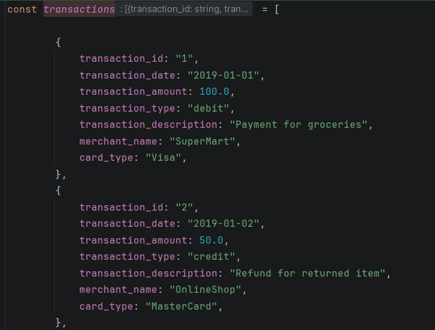

### 2. Реализация функций

#### Уникальные типы транзакций

**getUniqueTransactionTypes(transactions)**

Используется `Set` для получения уникальных значений.

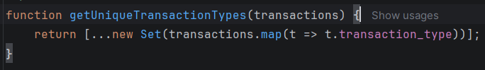

#### Общая сумма транзакций

**calculateTotalAmount(transactions)**

Используется `reduce()`.

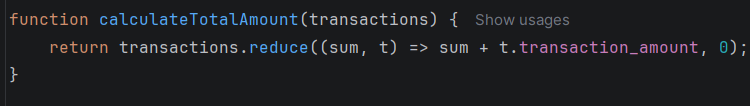

#### Сумма по дате

**calculateTotalAmountByDate(transactions, year, month, day)**

Используются `filter()` + `reduce()`.

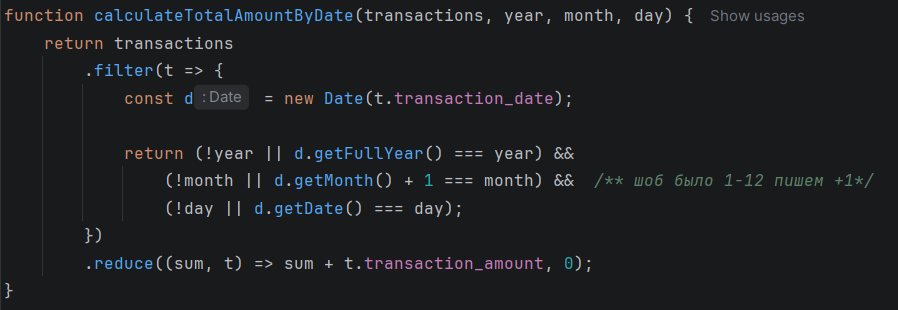

#### Фильтр по типу

**getTransactionByType(transactions, type)**

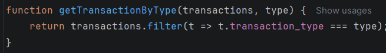

#### Диапазон дат

**getTransactionsInDateRange(transactions, startDate, endDate)**

Возвращает транзакции в заданном диапазоне дат.

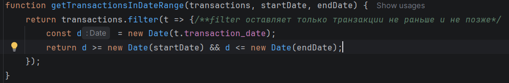

#### По магазину

**getTransactionsByMerchant(transactions, name)**

Фильтрует транзакции по названию магазина (`merchant_name`).

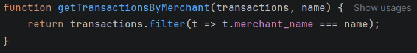

#### Среднее значение

**calculateAverageTransactionAmount(transactions)**

Вычисляет среднюю сумму транзакций (сумма / количество).

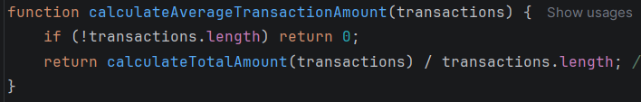

#### Диапазон суммы

**getTransactionsByAmountRange(transactions, min, max)**

Возвращает транзакции, сумма которых находится в заданном диапазоне.

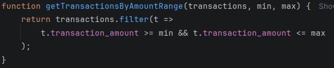

#### Сумма дебетовых операций

**calculateTotalDebitAmount(transactions)**

Сначала фильтруются `debit`, затем считается сумма через `reduce()`.

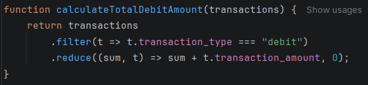

#### Месяц с максимумом транзакций

**findMostTransactionsMonth(transactions)**

Определяет месяц, в котором было больше всего транзакций.

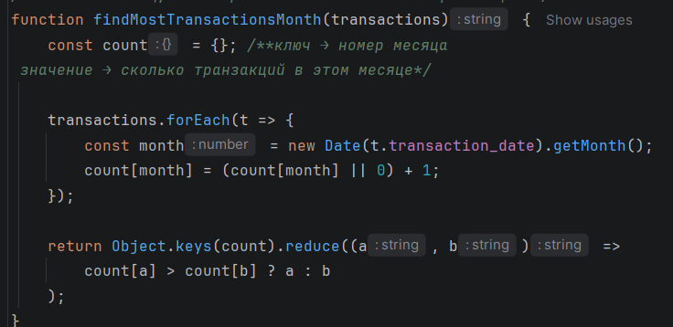

#### Месяц с дебетовыми

**findMostDebitTransactionMonth(transactions)**

Аналогично предыдущему, но только для `debit`.

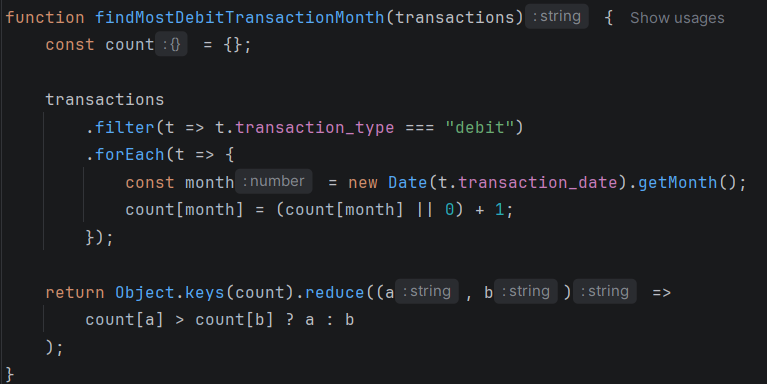

#### Какой тип чаще

**mostTransactionTypes(transactions)**

Сравнивает количество `debit` и `credit`.

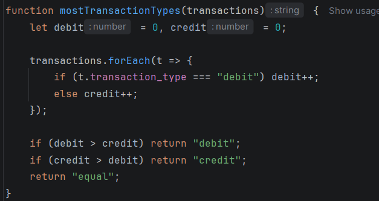

#### До определённой даты

**getTransactionsBeforeDate(transactions, date)**

Возвращает транзакции, которые были раньше указанной даты.

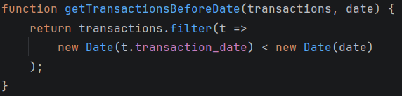

#### Поиск по ID

**findTransactionById(transactions, id)**

Находит одну транзакцию по её ID с помощью `find()`.

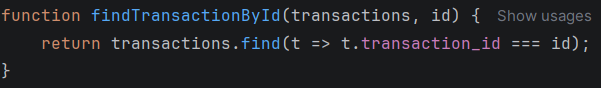

#### Получение описаний

**mapTransactionDescriptions(transactions)**

Создаёт новый массив только с описаниями транзакций (`map()`).

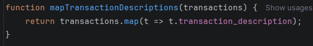

## Тестирование

Все функции были протестированы с помощью `console.log()`.

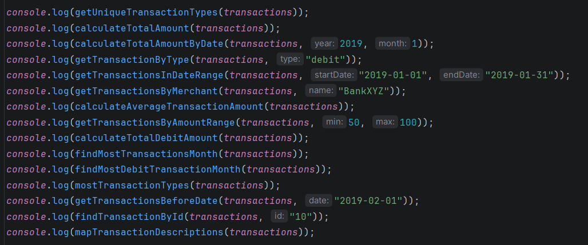

## Использованные методы массивов

* `map()` — преобразует массив
* `filter()` — фильтрует элементы
* `reduce()` — сводит к одному значению
* `find()` — находит элемент
* `forEach()` — перебирает массив

## Контрольные вопросы

### 1. Какие методы массивов используются?

map(), filter(), reduce(), find(), forEach()

### 2. Как сравнивать даты?

С помощью:

new Date("2019-01-01")

И операторов сравнения (`>`, `<`, `===`)

### 3. Разница между map(), filter(), reduce()

* **map()** — изменяет каждый элемент
* **filter()** — оставляет нужные
* **reduce()** — объединяет в одно значение

## Вывод

В ходе лабораторной работы были изучены методы работы с массивами в JavaScript. Реализованы функции для анализа транзакций, включая фильтрацию, поиск и вычисления. Получены навыки работы с массивами объектов и датами.

