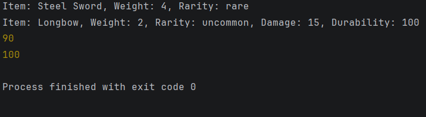
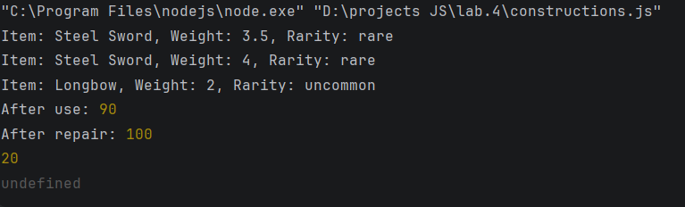

# Лабораторная работа №4

## Продвинутые объекты в JavaScript

## Цель работы

Изучить классы и объекты в JavaScript, научиться создавать классы, использовать конструкторы и методы, а также реализовывать наследование.

---

## Задание

Создать консольное приложение, моделирующее систему инвентаря, где можно добавлять предметы, изменять их свойства и управлять ими.

---

## Реализация

### 1. Класс Item

Создан класс Item, который представляет базовый предмет инвентаря.

Поля:

* name — название предмета
* weight — вес предмета
* rarity — редкость предмета

Методы:

* getInfo() — возвращает информацию о предмете
* setWeight(newWeight) — изменяет вес предмета

---

### 2. Класс Weapon

Создан класс Weapon, который наследуется от Item.

Дополнительные поля:

* damage — урон оружия
* durability — прочность оружия

Методы:

* use() — уменьшает прочность на 10
* repair() — восстанавливает прочность до 100
* getInfo() — переопределяет метод базового класса

---

### 3. Тестирование

Созданы объекты классов Item и Weapon.
Проверена работа методов:

* создание объектов
* изменение веса
* использование оружия
* восстановление прочности

---

### 4. Функции-конструкторы

Реализована альтернативная версия с использованием функций-конструкторов.

Использованы:

* prototype для добавления методов
* Object.create для наследования
* call для вызова родительского конструктора

---
# Контрольные вопросы

---

## 1. Какое значение имеет `this` в методах класса?

Ключевое слово `this` в методах класса позволяет взаимодействовать с полями класса для их добавления, изменения и обработки.

`this` ссылается на конкретный экземпляр класса, созданный при вызове конструктора.

---

## 2. Как работает модификатор доступа `#` в JavaScript?

Модификатор доступа `#` позволяет сделать определённые поля или методы приватными, то есть скрытыми от использования вне класса.

Он обеспечивает настоящую инкапсуляцию и защищает данные от внешнего доступа.

---

## 3. В чем разница между классами и функциями-конструкторами?

Классы и функции-конструкторы — это два способа создания объектов с прототипным наследованием.

Классы в JavaScript являются синтаксическим сахаром над функциями-конструкторами и имеют более удобный и понятный синтаксис.

Функции-конструкторы имеют особенности hoisting (поднятия), то есть могут быть вызваны до объявления.

При использовании классов обязательно нужно использовать `new`, тогда как функции-конструкторы теоретически можно вызывать и без `new`, хотя это считается ошибкой.

---

## Итог

Классы — это более современный и удобный способ создания объектов, а функции-конструкторы — более старый и “низкоуровневый” механизм с тем же принципом прототипного наследования.

## Вывод

В ходе работы были изучены основы объектно-ориентированного программирования в JavaScript, включая создание классов, наследование, методы объектов и альтернативную реализацию через функции-конструкторы.
