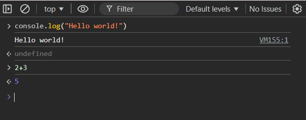
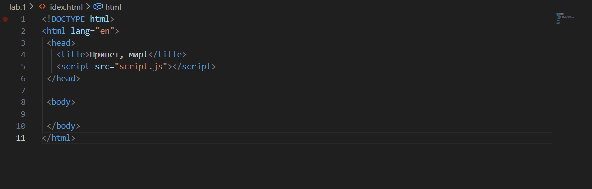
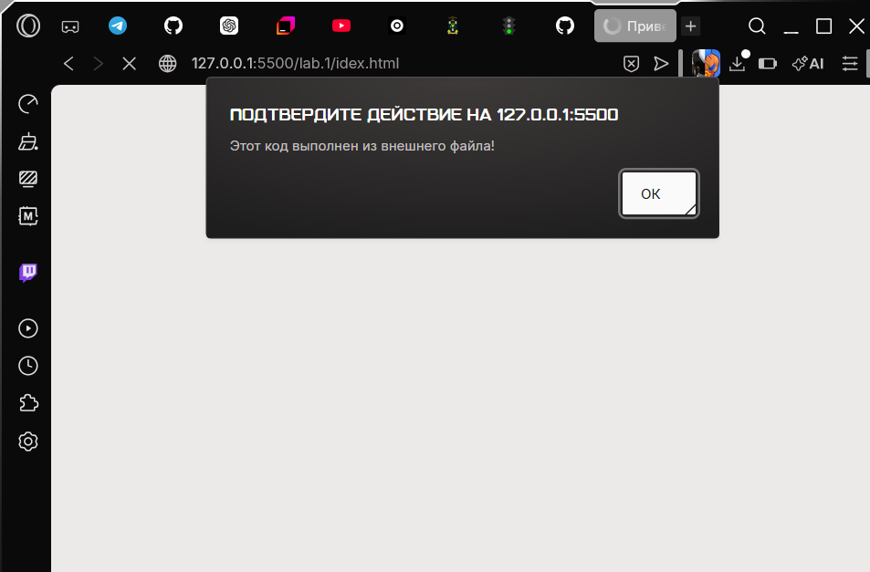
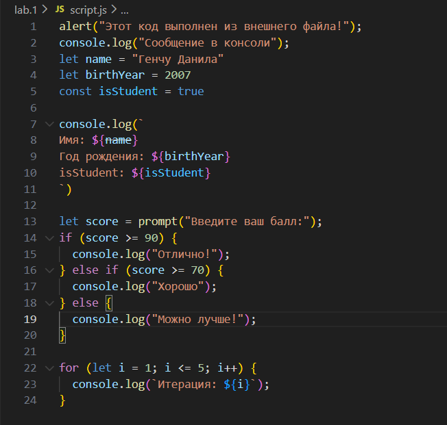

**Ghenciu Danila IA2504 Lab_1**

# Лабораторная работа №1

## Задание №1: Выполнение кода в браузере



### Задание №1.2: Создание первой HTML-страницы с JavaScript



### Задание №1.3: Подключение внешнего JS-файла

Внешний JavaScript-файл содержит следующий код:
`alert("Этот код выполнен из внешнего файла!");  
console.log("Сообщение в консоли");`


### Задание №1.4: Подключение JS-файла в *index.html*

Для подключения скрипта используется следующая строка:

```html
<script src="script.js" defer></script>
```

## Задание №2: Работа с типами данных

Были созданы переменные `name`, `birthYear`, `isStudent`.
После этого их значения были выведены в консоль.

### Задание №2.2: Управление потоком выполнения (условия и циклы)



## Итоги

* `var` — устаревший способ объявления переменных;
* `let` — современный способ, позволяющий объявлять переменные с блочной областью видимости;
* `const` — используется для объявления константных значений.

Неявное преобразование типов — это автоматическое приведение значения одного типа данных к другому.

* Оператор `==` сравнивает значения с приведением типов (использовать не рекомендуется);
* Оператор `===` сравнивает значения без приведения типов (рекомендуется к использованию).

---

Если хочешь — могу сделать версию **более формальную (преподавательскую)** или наоборот **ещё проще**.
